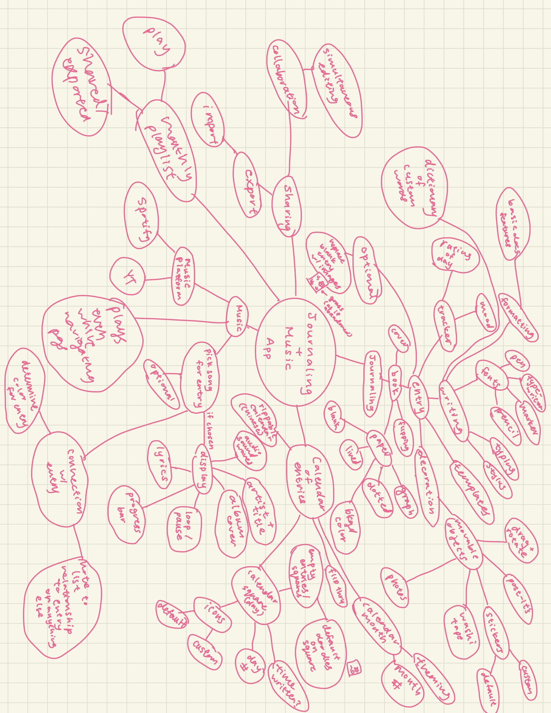

# Brainstorming

## Technique 1: Mind Mapping

## Technique 2: World's Worst Idea

A plain html file where each entry is a text box with no formatting available, and for the song, you just paste a link into it. This link, however, is not hyperlink but simply the URL to the song. For the view of all your entries, it’s just a list of links numbered 1-entry #. U can’t play music and everything is black and white. You lose everything as soon as u reload the page/exit out of the entry with no way of retrieving all that lost information. The only joy you get is being able to write one single sad-looking journal entry that will disappear into the abyss as soon as you get the motivation to write another.